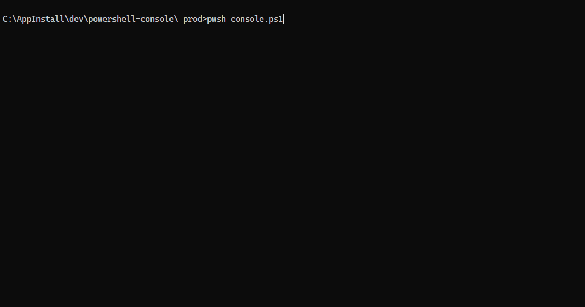

# PowerShell Console

[](https://github.com/sponsors/Gronsten)

A comprehensive, interactive PowerShell management console for AWS infrastructure, package managers, development utilities, and system administration. Features multi-account AWS management with Okta SSO, unified package management (Scoop/npm/pip/winget), development environment backups, and network utilities.

> [!TIP]
> **NEW in v1.12.0:** About menu with version info, smart backup tracking (only FULL backups), standardized pause commands, and hidden environment indicator for cleaner UI!

> [!NOTE]
> **DEV/PROD Environment Separation:** This project uses a dual environment structure (`_dev/` for development, `_prod/` for production) with a smart upgrade script that automatically merges configuration changes while preserving your custom settings.

## Demo



*Interactive arrow-key navigation, AWS account switching, package management, and more*

## Features

### AWS Account Management
- **Multi-Account Support**: Seamlessly switch between multiple AWS accounts and regions
- **Multi-Role Authentication**: Support for multiple IAM roles per account with preferred role selection
- **Okta SSO Integration**: Automated authentication using okta-aws-cli with configurable session durations
- **Account Synchronization**: One-click sync to discover all AWS accounts and roles from Okta
- **Persistent Configuration**: Customizable menu order and display names saved to config.json
- **AWS Logout Script**: Clean logout from okta-aws-cli sessions
  - Clears `[default]` profile credentials from `~/.aws/credentials`
  - Preserves all other profiles
  - Automatic backup with error recovery
  - Usage: `.\scripts\aws-logout.ps1`
- **AWS Prompt Indicator (Optional Module)**:
  - **Smart session display** - Shows AWS account friendly name in prompt (falls back to username)
  - **Visual indicators** - Bright green checkmark on match, bright red warning on mismatch
  - **Context-aware** - Indicators only appear in directories mapped to AWS accounts
  - **oh-my-posh theme integration** - Pre-configured quick-term theme with AWS features
  - **Simple setup** - Two-line PowerShell profile integration
  - **Performance optimized** - Smart caching (<1ms typical, no slow prompts when logged out)
  - See [modules/aws-prompt-indicator/README.md](modules/aws-prompt-indicator/README.md) for setup

### EC2 Instance Management
- **Interactive Instance Selection**: Arrow-key navigation for browsing running EC2 instances
- **Instance Configuration**: Set default instances for jump boxes and remote hosts per account
- **Visual Indicators**: Clear marking of default instances and remote hosts in listings
- **Instance Details**: Display instance names, IDs, IPs, states, and types in formatted tables
- **AWS Context Display**: Always shows current account, account ID, and region for clarity

### Remote Access & Connectivity
- **Aloha Remote Access**: Automated AWS SSM port forwarding with RDP launcher integration
- **Port Forwarding Configuration**: Configurable local and remote ports per account
- **Connection Templates**: Pre-configured connection profiles for different environments
- **Session Management**: AWS Systems Manager session integration for secure connections

### VPN Management
- **VPN Connection Search**: Search and list VPN connections across AWS accounts
- **Formatted Output**: Table display with VPN names and connection IDs
- **Export Capability**: Save VPN listings to timestamped text files

### Package Manager Integration
- **Multi-Manager Support**: Unified interface for Scoop, npm, pip (PyPI), and winget package managers
- **Update Management**:
  - Check for updates across all package managers
  - Interactive checkbox selection for selective updates
  - Bulk update all packages with one command
- **npm Package Search (v1.2.3)**:
  - **5x faster** search using PowerShell runspaces for parallel metadata retrieval
  - **Complete Package Database**: Local copy of 3.6M+ npm packages (auto-downloads on first use)
  - **Package Name Only Search**: Searches package names, not descriptions
  - **Relevance Sorting**: Shorter/exact matches appear first
  - **Table Format**: Clean columnar display (NAME | VERSION | DESCRIPTION)
  - **Auto-Update**: Checks for stale data (>24 hours) and prompts to update
  - **Pagination**: 20 results at a time with "Show more? (Y/n)" prompt
  - **[I] Indicator**: Shows installed packages in green
- **pip/PyPI Search (v1.2.2)**:
  - JSON API integration for fast global package search
  - Smart package discovery with common variations (python-X, X-python, pyX)
  - Shows package version, summary, and homepage
- **Package Listing**: View all installed packages sorted alphabetically
- **Smart Parsing**: Properly handles package manager output formatting and progress indicators

### Network Utilities
- **Interactive Ping**: Continuous ping with real-time latency display (press Q to quit)
- **Network Configuration**: Comprehensive display of network adapters, IPs, DNS, DHCP settings
- **Sorted Display**: Adapters sorted by status (Up first) and IP type (routable first)

### Development Utilities
- **Code Line Counter**: Fast Python-based line counter with project-specific exclusions
  - Count all projects or select specific folders interactively
  - CLI support for flexible usage
  - Handles multiple encodings and file types
  - Project-aware exclusions (logs, backups, node_modules, etc.)
- **Backup Dev Environment**: Advanced development environment backup utility
  - Two-pass operation with file counting and progress tracking
  - Multiple operation modes (test, list-only, count-only, full backup)
  - GNU-style command-line arguments with comprehensive help
  - Visual progress indicators with spinner and percentage display
  - Uses robocopy for efficient mirroring with intelligent retry logic
  - Dual logging system (detailed log + rotating summary history)
  - Smart log rotation (keeps last 7 backup summaries)
  - Configurable paths via config.json
  - Runtime statistics and completion reporting
- **Meraki Backup**: Automated Meraki network configuration backup
  - Python-based backup script integration
  - Environment variable validation

### Menu System Features
- **Arrow-Key Navigation**: Intuitive up/down arrow navigation with Enter to select
- **In-Menu Editing**:
  - Ctrl+Space to move menu items
  - Ctrl+R to rename menu items
  - Changes persist to config.json automatically
- **Menu Position Memory**: Remembers last selected item per menu during session
- **Multi-Level Navigation**: ESC to go back one level, Ctrl+X to exit completely
- **Dynamic Menus**: AWS account menu dynamically generated from Okta sync
- **Customizable Menus**: Main Menu, Package Manager, and Instance Management menus fully customizable
- **About Menu**: Version information, repository links, sponsor info, and command-line help

### Configuration Management
- **JSON Configuration**: All settings stored in config.json for easy editing
- **Environment-Specific Settings**: Per-account instance IDs, ports, and connection details
- **Profile Mapping**: Automatic mapping of AWS roles to Okta profile names
- **Backup on Sync**: Automatic backup of config.json and okta.yaml before sync operations
- **Auto-Reload**: Configuration reloaded after changes for immediate effect

### User Experience
- **UTF-8 Console Support**: Proper character rendering for all output
- **Color-Coded Output**: Visual distinction using foreground colors (Green=success, Yellow=info, Red=error)
- **Timed Pauses**: Auto-continue timers with countdown and manual override
- **Spinner Animations**: Visual feedback during authentication and long operations
- **Clear Headers**: Section headers with box-drawing characters for visual organization
- **Context Awareness**: AWS account context displayed at top of relevant menus

## Prerequisites

- **PowerShell 5.1+** (Windows PowerShell) or **PowerShell 7+** (PowerShell Core)
- **AWS CLI** v2 installed and configured
- **okta-aws-cli** installed for Okta authentication
- **AWS Systems Manager Session Manager Plugin** for SSM connections
- **Package Managers** (optional):
  - Scoop (for Windows package management)
  - npm (for Node.js global packages)
  - pip (for Python packages)
  - winget (Windows Package Manager)

## Installation

1. Clone this repository:
```powershell
git clone https://github.com/yourusername/powershell-console.git
cd powershell-console
```

2. Copy `config.example.json` to `config.json`:
```powershell
Copy-Item config.example.json config.json
```

3. Edit `config.json` and configure:
   - File paths (working directory, PowerShell profile, Okta config)
   - Default AWS region
   - Initial environment configurations

4. Run the script:
```powershell
.\console.ps1
```

See [SETUP.md](SETUP.md) for detailed configuration instructions.

## Usage

### First Time Setup

1. **Launch the script**: `.\console.ps1`
2. **Navigate to AWS Login** from Main Menu
3. **Select "Sync AWS Accounts from Okta"** to discover all available accounts and roles
4. **Authenticate with Okta** when prompted (one-time for all accounts)
5. **Select an AWS account** from the menu to authenticate
6. **Configure instance settings** via Instance Management menu as needed

### Daily Workflow

1. Launch script
2. Select "AWS Login" from Main Menu
3. Choose your AWS account (menu remembers last selection)
4. Use Instance Management features:
   - View running instances
   - Configure default instances
   - Launch Aloha remote access
   - Search VPN connections

### Package Management Workflow

1. Select "Package Manager" from Main Menu
2. Choose "Manage Updates" to see all available updates
3. Use arrow keys and spacebar to select packages
4. Press Enter to install selected updates

### Backup Dev Environment Workflow

The backup-dev.ps1 script can be run directly from PowerShell with various options:

```powershell
# Full backup (with confirmation)
.\backup-dev.ps1

# Test mode - preview first 100 operations
.\backup-dev.ps1 --test-mode

# Test mode with custom limit (250+ operations)
.\backup-dev.ps1 --test-mode 500

# List-only mode - preview all changes without executing
.\backup-dev.ps1 --list-only

# Count-only mode - just count files and directories
.\backup-dev.ps1 --count

# Help - show all available options
.\backup-dev.ps1 --help
```

**Features:**
- **Two-pass operation**: First pass counts files, second pass performs backup with accurate progress
- **Visual progress**: Real-time progress bar with percentage, spinner, and statistics
- **Smart logging**: Detailed operation log + rotating summary history (keeps last 7)
- **Safe testing**: Test and list-only modes let you preview before executing
- **Efficient mirroring**: Uses robocopy with /MIR flag for true synchronization

### Menu Customization

- **Move items**: Press Ctrl+Space, use arrows to reposition, Enter to save
- **Rename items**: Press Ctrl+R, type new name, Enter to save
- **Reset to defaults**: Delete the "menus" section from config.json

## Configuration

### config.json Structure

```json
{
  "paths": {
    "workingDirectory": "C:\\path\\to\\working\\directory",
    "profilePath": "C:\\path\\to\\Microsoft.PowerShell_profile.ps1",
    "oktaYamlPath": "C:\\Users\\username\\.okta\\okta.yaml"
  },
  "aws": {
    "defaultRegion": "us-east-1"
  },
  "environments": {
    "accountkey": {
      "displayName": "Account Display Name",
      "accountId": "123456789012",
      "region": "us-east-1",
      "sessionDuration": "3600",
      "availableRoles": ["Admin", "devops"],
      "preferredRole": "Admin",
      "oktaProfileMap": {
        "Admin": "accountkey-CFA-OKTA-PROD-Admin",
        "devops": "accountkey-CFA-OKTA-PROD-devops"
      },
      "instances": {
        "jump-box": "i-0123456789abcdef0",
        "remote-host": "i-0fedcba9876543210"
      },
      "defaultRemoteIP": "10.0.1.10",
      "defaultRemotePort": "3389",
      "defaultLocalPort": "8388"
    }
  }
}
```

See [SETUP.md](SETUP.md) for detailed configuration options.

## Key Functions

### AWS Authentication
- `Start-AwsWorkflow`: Main AWS login workflow entry point
- `Show-AwsAccountMenu`: Display AWS account selection menu
- `Invoke-AwsAuthentication`: Execute Okta authentication for selected account
- `Sync-AwsAccountsFromOkta`: Discover all AWS accounts and roles from Okta

### Instance Management
- `Show-InstanceManagementMenu`: Instance management menu
- `Get-RunningInstances`: List all running EC2 instances with details
- `Select-Ec2Instance`: Interactive instance selection with arrow navigation
- `Set-DefaultInstanceId`: Configure default jump box instance
- `Set-DefaultRemoteHostInfo`: Configure default remote host settings

### Remote Access
- `Start-AlohaRemoteAccess`: Launch automated Aloha connection with SSM port forwarding
- `Start-AlohaConnection`: Core AWS SSM session and port forwarding logic

### Package Management
- `Show-PackageManagerMenu`: Package manager menu
- `Select-PackagesToUpdate`: Interactive update selection across all package managers
- `Search-Packages`: Search installed or globally available packages
- `Get-InstalledPackages`: List all installed packages

### Menu System
- `Show-ArrowMenu`: Core arrow-key navigation menu engine
- `Save-Menu`: Persist menu customizations to config.json
- `Get-MenuFromConfig`: Load customized menus from config.json
- `Save-MenuPosition`: Remember last menu selection
- `Get-SavedMenuPosition`: Restore last menu selection

## Development History

**Project renamed from `powershell-aws-console` to `powershell-console` in v1.2.3** to better reflect expanded functionality beyond AWS management.

This project has evolved through extensive development with comprehensive tracking in CHANGELOG.md. Key milestones include:

**Recent Major Features:**
- **v1.2.3 (2025-11-05)**: Project rename + npm search rewrite (5x faster with runspaces) + backup progress fix
- **v1.2.2 (2025-11-04)**: PyPI/pip search integration with JSON API
- **v1.2.1 (2025-11-01)**: Minor updates and improvements
- **v1.2.0 (2025-11-01)**: Additional feature enhancements
- **v1.1.0 (2025-10-31)**: Backup Dev Environment with GNU-style arguments and progress tracking

**Core Features:**
- Initial menu system with arrow-key navigation
- AWS multi-account and multi-role support
- Okta authentication integration
- Account synchronization from Okta
- Package manager integration (Scoop, npm, pip, winget)
- Interactive update management
- Menu customization and persistence
- AWS context display and instance management
- VPN connection search and export
- Network configuration display
- Aloha remote access automation

See [CHANGELOG.md](CHANGELOG.md) for complete development history and [GitHub Releases](https://github.com/Gronsten/powershell-console/releases) for detailed release notes.

## Troubleshooting

### "RequestExpired" AWS Error
- Credentials have expired. Select "Change AWS Account" and re-authenticate.

### Okta Authentication Fails
- Verify `okta.yaml` is properly configured with correct IDP mappings
- Check that session duration in config.json matches Okta settings
- Ensure okta-aws-cli is installed and in PATH

### Instance List Shows Wrong Account
- Check that `$global:currentAwsProfile` is correctly set
- Verify oktaProfileMap in config.json matches actual Okta profile names
- Try re-authenticating to the account

### Menu Changes Don't Persist
- Ensure config.json is writable
- Check that you're using Ctrl+Space/Ctrl+R to save changes
- Verify "menus" section exists in config.json

## Contributing

Contributions are welcome! Please feel free to submit issues or pull requests.

## License

MIT License - see [LICENSE](LICENSE) file for details.

## Acknowledgments

Built with PowerShell for Windows environments, integrating:
- AWS CLI and AWS Systems Manager
- okta-aws-cli for Okta SSO
- Scoop, npm, and winget package managers
- Windows Console with UTF-8 and ANSI color support
